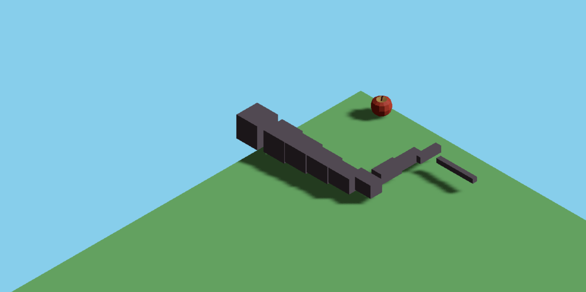

# Snake Game Javascript

I try to create a snake game with typescript



## Try locally

Install node dependencies

```bash
npm i
```

Run

```bash
npm run dev
```

now go to http://localhost:5173

## Try locally with docker

Build the image

```bash
docker build --tag=game-snake .
```

Run the server

```bash
docker run --rm -p 8000:80 game-snake
```

now go to http://localhost:8000

## Todo
- show score and highscore
- add restart button instead of refresh the whole page
- add menu to adjust size, color and speed for snake
- add menu to adjust size and color for food
- add menu to adjust canvas size and color
- customization game over if the snake is eating itself
